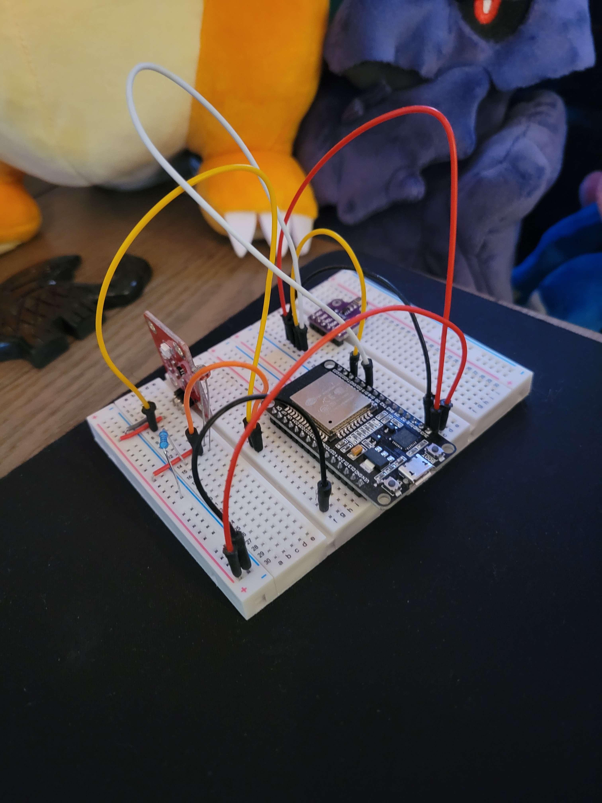
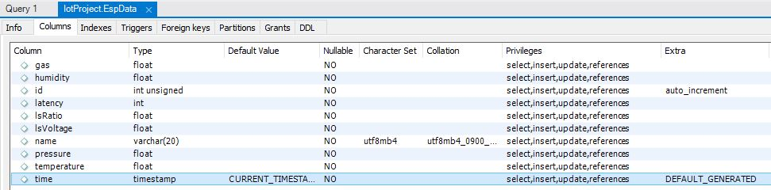

# Weather Data Collection with ESP32 and AWS
In this project, we used AWS IoT, RDS, and Lambda alongside and ESP32 microcontroller to collect weather/indoor environment data for a Grafana dashboard. This guide walks you through the steps to configure the project, as well as minor troubleshooting.
## Requirements
- Hardware
    - DOIT ESP32 DEVKITV1 or similar ESP32 microcontroller
    - Adafruit BME 680 Breakout Sensor
    - Adafruit CdS Photoresistor (Photo Cell)
    - Breadboard and Jumper Cable
- Software
    - Arduino IDE
    - Grafana
    - MySQL Server 8.X
    - (Suggested) MySQL Workbench
- Arduino Libraries
    - ESPPerfectTime
    - PubSubClient
    - Arduino JSON
    - Adafruit BME 680

## Project Configuration

### Hardware
Follow the schmatic below for configuring your breadboard.  
Note this picture also includes an optional UV sensor.  

### AWS RDS
- In AWS RDS Console, launch a new MySQL instance for free tier
    - Make the RDS publically visible
    - Under security, allow all traffic from the default security group and your IP
    - Note your database username and password
- Download MySQL Workbench and Server 8.0
- Using the command-line or Workbench, access the database (once in Ready Status) with your credentials
- Create a new schema and table, noting their names

### ESP32
- Clone the repository and open the `main.ino` file with Arduino IDE
- Add the `secrets_temp.h` file to your arduino project, rename it `secrets.h`
- Configure your WiFi Credentials in your local `secrets.h` file, we will revisit this later
    - Note: If using a public network, leave the WiFi password as an empty string
- Install all libraries mentioned above using the Library Manager
    - Also add ESP32 configurations to the board manager, check the [ExpressIf Guide](https://espressif-docs.readthedocs-hosted.com/projects/arduino-esp32/en/latest/installing.html)
- Configure your Device name in the `main.ino` on line 34
- Set the Arduino Serial Monitor to 115200 to see logs

### AWS IoT Core
- In the AWS Console, find AWS IoT Core -> Things -> Create Things -> Create Single Thing
- Enter a Thing name and keep the default settings
- Attach a policy allowing IoTPublish, IoTSubscribe, IoTConnect, IoTReceive, this allows MQTT messaging
- Finish creating the Thing and download the keys, certificate and CA1 files
- In your `secrets.h`, copy and paste the keys and certs into the respective variables between the Begin and End certificate/key lines
- In the AWS Console for IoT Core, go to Message Routing -> Rules
- Create a new rule that listens to AWS_IOT_PUBLISH_TOPIC from the `main.ino` (default topic `esp32/pub`)
- Attach the sample SQL filter from the source into Rule's SQL statement block
- Create a new action for an AWs Lambda function, calling the function IoTToRDS

### AWS Lambda
- In AWS Lambda, upload the `lambda_function.zip` file into the lambda editor
- Click Add Trigger and find your AWS IoT Rule you created
- Modify the Lambda script with your database endpoint, schema name, table name,username, and password
- Under the Configuration Tab, perform the following
    - Under VPC -> Edit, add the default VPC and all subnets shared with the MySQL Instance (check the RDS console MySQL instance)
    - Under Permissions, attach a policy to the IoT rule allowing Lambda Function Invocation
    - (Suggested) Test that lambda function with `lambda_test.json` provided in the source folder

### Grafana
- Download Grafana, install, and start the Grafana service
- Go to `localhost:3000` in a browser of your choice
- Under the Settings Cog -> Data Sources, click Add Data Source
- Select MySQL
    - Set the Endpoint to the AWS Endpoint for the database
    - Set the username and password for the database
    - Set the min time interval to the rate the ESP32 is configured to publish for update to date dashboard (default 1 min)
    - Click Save and Test, you should get a connection successful
        - If you don't double check configuration and if your IP is allowed under the RDS Inbound Rules in the AWS Console
- Go back to Data Sources and start creating a dashboard.
- Note: The original schema was not setup very well since we didn't choose a good primary key. Setting the primary key to (timestamp, device name) should improve searching, query structure for Grafana, and help with sharding which needs a temporal primary key to shard by time instead of count.

### Notes
- Latency may show up as negative, this is because the ESP32 libraries only really supports second accurate timestamps. Due to SNTP drifting, this will cause latency recording to be inaccurate after time. Use an SQL filter to remove these values and reset the device to get a better timestamp. This may be changed or removed in future iterations.
- Be sure your AWS policies for each resource have all necessary access such as Lambda Invocation by the Messaging Rule, or RDS Inbound Firewall Rules allow your traffic

### Improvements
- Make the MySQL schema primary key (timestamp, device id) instead of a raw id column. This is improve searching greatly. Also, sharding would be helpful, especially since the cloud will charge if the db grows past some amount of GB storage. You may need to check AWS setting too.
- Investigate AWS IoT Core metrics to see if you can calculate latency or throughput there. Those metrics can be exported from the IoT core into AWS Quicksight too.
- Investigate other sensors to add to the ESP32 and data analytics like moving averages, stored procedures in the db may help this

You have now completed the project configuration! A sample dashboard can be seen below for reference.  
Dashboard configuration is left to the user to explore.
